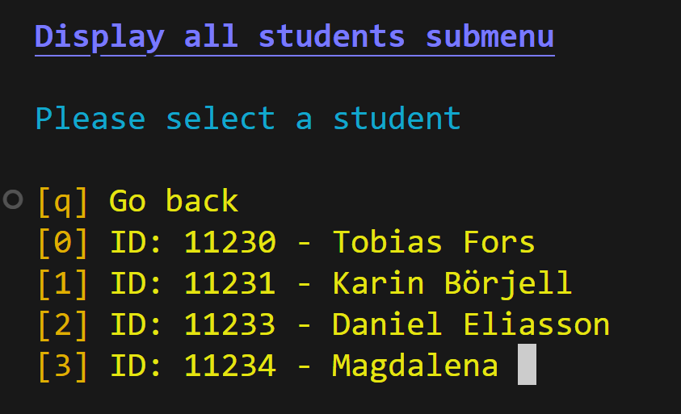

# Student Management System

A simple command-line interface (CLI) application for managing student records.
Done for an assignment during my basic programming course at Nackademin.

## Features

- **List Students**: View all students and their details
- **Add Students**: Add new student records with validation
- **Remove Students**: Remove existing student records
- **View Student Details**: Access personal information and grades

## Technical Details

- Built with Python
- Uses regular expressions for email validation
- Features colored terminal output for better user experience
- Implements input validation for student data entry

## Usage

Run the program with:

```bash
python student_system.py
```

### Navigation

- Use the numeric keys to select menu options
- Press 'q' to return to previous menus or exit the program
- Follow on-screen prompts for data entry

## Data Structure

The system stores the following information for each student:
- Full name
- Email address
- Age
- Student ID (auto-generated)
- Course grades

## Preview


